# Cargo Trains

This is a program that finds the type of cargo that a train can carry when it enters a station. When a train enters a station, it first unloads a type of cargo, and then loads another type of cargo. It builds a graph of stations with directed edges as tracks and traverses them to find the cargo that can be carried. If it finds any cycles in the graph, it updates the nodes inside with the cargo gathered while traversing through the cycle.

### Example:

```mermaid
graph LR
    S1("<b>Station 1</b><br/>Unloads: 0<br/>Loads: 10<br/><i>Final: {}</i>")
    S2("<b>Station 2</b><br/>Unloads: 10<br/>Loads: 20<br/><i>Final: {10, 20, 30, 40}</i>")
    S3("<b>Station 3</b><br/>Unloads: 5<br/>Loads: 30<br/><i>Final: {20, 30, 40}</i>")
    S4("<b>Station 4</b><br/>Unloads: 6<br/>Loads: 40<br/><i>Final: {20, 30, 40}</i>")

    S1 -->S2
    S2 -->S3
    S3 -->S4
    S4 -->S2
    
    style S1 fill:#000,stroke-width:1px
    style S2 fill:#000,stroke-width:1px
    style S3 fill:#000,stroke-width:1px
    style S4 fill:#000,stroke-width:1px
```



Station 1 doesn't have any cargo type because the train starts without any cargo. 
Station 2 has cargo type 10 loaded from the first station, and the rest from going through the cycle in the graph.
Similarly, stations 3 and 4 have cargo types 20, 30, and 40 from the cycle, while the cargo of type 10 is unloaded at station 2.

## Getting Started

### Clone the repository

```bash
git clone git@github.com:Harry-258/CargoTrains.git
```

### Run the program

From the root directory run:

```bash
python main.py
```

Follow the instructions and at the end you will see the results printed to the terminal.

### Run the tests

From the root directory run:

```bash
python -m unittest discover -s tests -v
```
